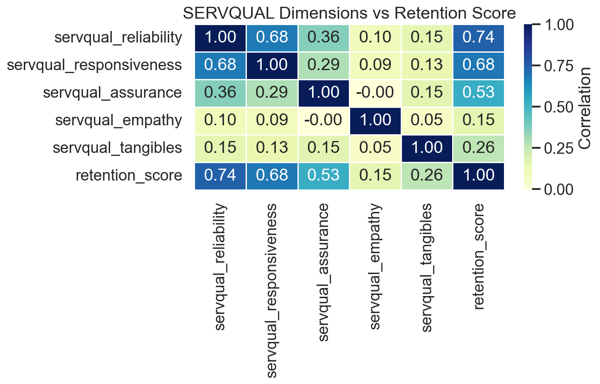
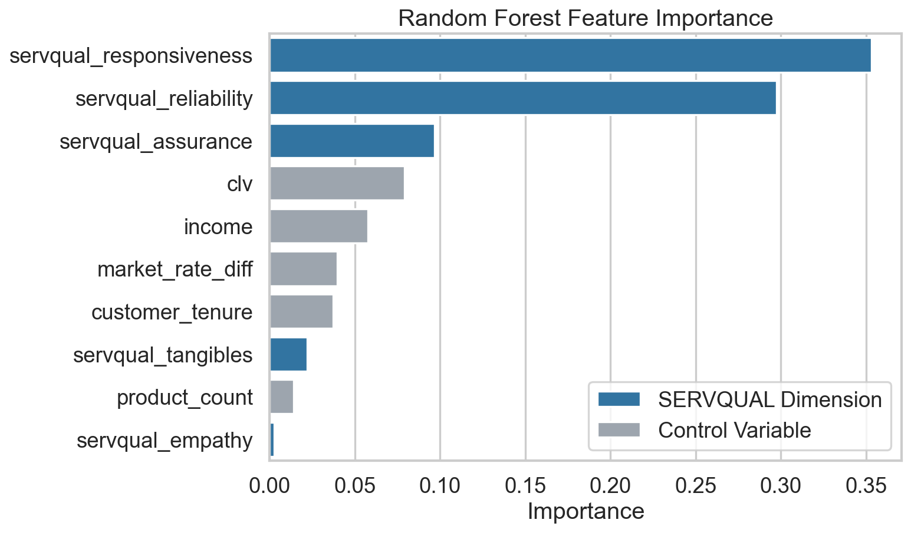
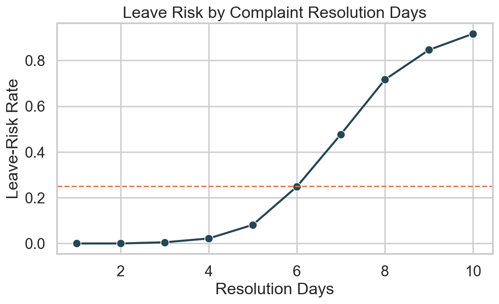
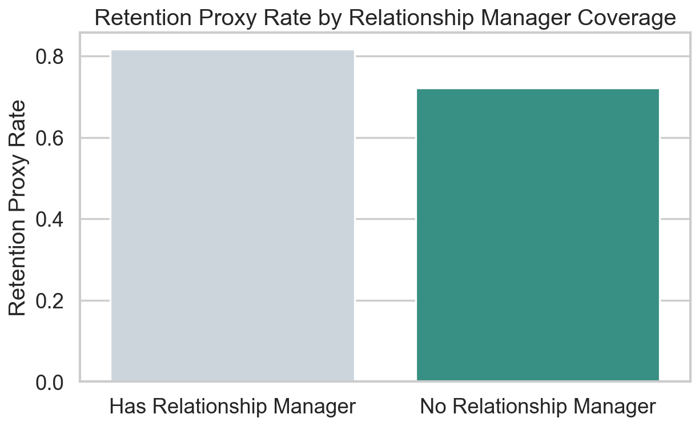

# Retail Banking Leave-Risk Analysis

This project analyzes a retail banking customer dataset to understand service-quality drivers of customer retention and identify customers who are most likely to leave. It combines SERVQUAL-based service metrics, business thresholds, and machine learning outputs to produce decision-ready CSV summaries, risk charts, and a lightweight local dashboard.

## Project Overview

The workflow in this repository:

- loads the `Retail_Banking_Dataset_JKBank.csv` dataset
- builds SERVQUAL-based service quality measures
- creates a leave-risk proxy target from low retention scores because the source `churn_flag` does not contain observed leavers
- trains a model to estimate customer leave propensity
- exports summary tables and high-risk customer lists
- serves a browser-based dashboard for quick review

## Key Highlights

- Model accuracy: `85.65%`
- Model precision: `67.63%`
- Model recall: `81.70%`
- Strongest SERVQUAL predictor: `servqual_responsiveness`
- Customers with `resolution_days > 6.5` show about `6.28x` higher leave risk than the rest
- Customers with a relationship manager have lower predicted leave probability (`22.64%`) than those without one (`34.63%`)

## Repository Contents

- `retail_banking_analysis.py`: main analysis pipeline that reads the dataset, computes SERVQUAL metrics, trains the model, and exports outputs
- `retail_banking_dashboard.py`: local dashboard server for viewing charts, summary tables, and highest-risk customers
- `Retail_Banking_Dataset_JKBank.csv`: source dataset used for analysis
- `final_project_output.csv`: customer-level output with risk and recommendation fields
- `likely_to_leave_customers.csv`: filtered list of high-risk customers
- `summary_model_metrics.csv`: model performance summary
- `summary_servqual_correlations.csv`: SERVQUAL-to-retention correlation results
- `summary_feature_importance.csv`: feature importance output from the model
- `summary_thresholds.csv`: threshold-based risk breakpoints
- `summary_relationship_manager_effect.csv`: relationship manager comparison summary

## How To Run

1. Install dependencies:

```bash
pip install pandas numpy matplotlib seaborn scikit-learn
```

2. Run the analysis:

```bash
python retail_banking_analysis.py
```

3. Start the dashboard:

```bash
python retail_banking_dashboard.py
```

4. Open the dashboard in your browser:

```text
http://127.0.0.1:8501
```

## Screenshots

### SERVQUAL Retention Heatmap



### Feature Importance



### Resolution Days Leave-Risk Threshold



### Relationship Manager Retention Comparison



## Use Case

This project is useful for:

- identifying customers who may require immediate retention intervention
- understanding which service-quality dimensions matter most for loyalty
- supporting branch, service, and digital-experience improvement decisions
- presenting banking analytics findings through both files and a simple dashboard
